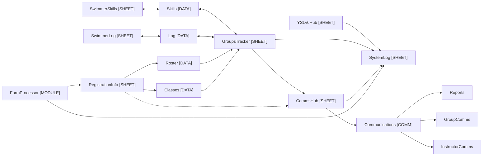
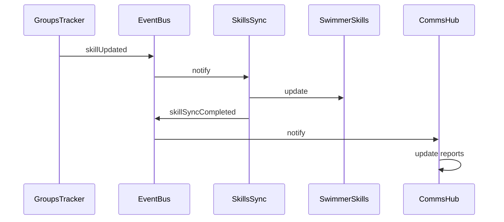
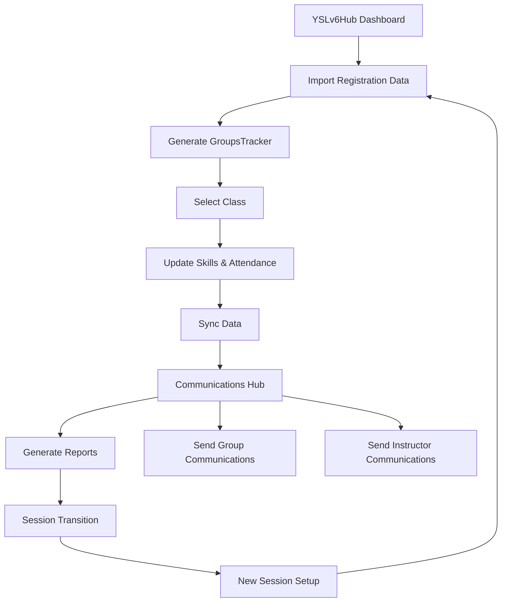
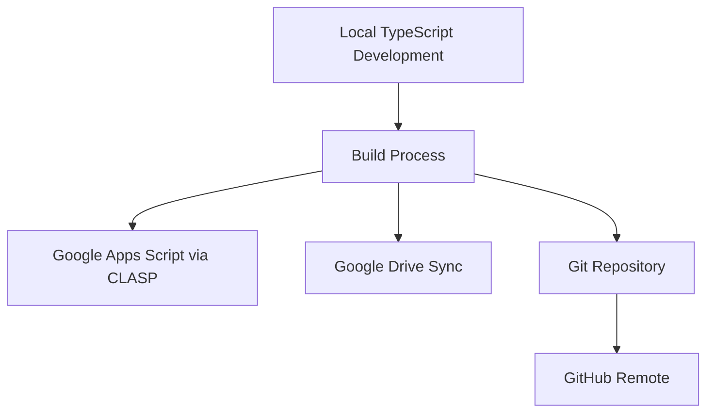

# YSLv6Hub Architecture

This document outlines the architecture of the YSLv6Hub application.

## Overview

YSLv6Hub is a Google Sheets application for managing swim lessons, built with TypeScript and Google Apps Script. It follows a modular architecture with well-defined components and data flow.

## Core Architecture

## Module Structure

The application is organized into the following modules:

### Core Modules

1. **00_System.ts**: System initialization and dashboard
   - Entry point for the application
   - Menu creation and management
   - Dashboard functionality
   - Sheet initialization and verification

2. **01_Core.ts**: Core utilities and services
   - Error handling
   - Event management
   - Caching
   - Feature flags
   - User management and permissions

3. **02_Administration.ts**: System administration
   - System configuration
   - User management
   - Role-based access control
   - System repair functions

### Functional Modules

4. **03_DataManagement.ts**: Data handling and importing
   - Registration data import
   - Smart date-range based selection
   - Data validation
   - Roster and Classes data generation

5. **04_GroupsTracker.ts**: Class tracking
   - GroupsTracker sheet creation and management
   - On-demand data loading
   - Class selection and management
   - Comprehensive view of student data

6. **05_SkillsSync.ts**: Skills management
   - Skills data structure
   - Bidirectional synchronization
   - Skill assessment tracking
   - Skill progression analysis

7. **06_LogManagement.ts**: Attendance tracking
   - Log data structure
   - Attendance recording and tracking
   - Attendance visualization
   - Activity logging

8. **07_Communications.ts**: Communications handling
   - Email templates
   - HTML formatting
   - Attachment support
   - Dynamic content insertion
   - Report generation
   - Group and instructor communications

9. **08_FormProcessor.ts**: Form processing and placement
   - Swimmer information form handling
   - Placement recommendation algorithms
   - Data integration with RegistrationInfo

### Utility Modules

10. **09_SessionManagement.ts**: Session transitions
    - Session archiving
    - Student continuity across sessions
    - Historical data preservation
    - Session analytics

11. **10_SystemLog.ts**: Enhanced logging
    - Structured logging
    - Log level filtering
    - Log searching and visualization
    - Error aggregation and reporting

12. **11_Testing.ts**: Test framework
    - Unit testing
    - Integration testing
    - Mock data generation
    - Performance testing

## Data Flow

The application follows these primary data flows:

1. **Registration Data Flow**:
   - User imports data to RegistrationInfo sheet
   - System generates Roster and Classes data
   - Classes data populates GroupsTracker options
   - Roster data populates student lists in GroupsTracker

2. **Skills Tracking Flow**:
   - Instructors update skills in GroupsTracker
   - Sync button pushes updates to SwimmerSkills via Skills data
   - SwimmerSkills preserves historical skill progression
   - Bidirectional sync ensures data consistency

3. **Attendance Flow**:
   - Instructors mark attendance in GroupsTracker
   - Attendance data syncs to SwimmerLog via Log data
   - SwimmerLog maintains attendance history
   - Attendance data is used for reporting

4. **Communications Flow**:
   - System pulls data from multiple sources to CommsHub
   - User generates reports or communications via CommsHub
   - Reports are created from Skills and Log data
   - Communications are sent to appropriate recipients

5. **Logging Flow**:
   - All system activities are logged to SystemLog
   - Errors and warnings are recorded with context
   - User actions are tracked for accountability
   - System health is monitored through log analysis

## Event-Driven Architecture

The application uses an event-driven architecture for decoupled communication:

## User Interface Flow

The user interface flow follows this pattern:

## Sheet Structure

Each sheet in the application has a specific purpose:

1. **YSLv6Hub [SHEET]**:
   - Main dashboard
   - Implementation guide
   - System status
   - Task management

2. **RegistrationInfo [SHEET]**:
   - Registration data import
   - Source for Roster and Classes data
   - Contains student and class information
   - Used for contact details

3. **GroupsTracker [SHEET]**:
   - Class tracking sheets
   - Skill and attendance recording
   - On-demand data loading
   - Central point for instructor interaction

4. **SwimmerSkills [SHEET]**:
   - Skills data repository
   - Historical skill assessment
   - Skill progression tracking
   - Source for reporting

5. **SwimmerLog [SHEET]**:
   - Attendance data repository
   - Activity recording
   - Attendance visualization
   - Source for reporting

6. **CommsHub [SHEET]**:
   - Communication management
   - Template management
   - Report generation
   - Communication history

7. **SystemLog [SHEET]**:
   - System activity logging
   - Error tracking
   - Performance monitoring
   - User action audit trail

## Deployment Architecture

The application is deployed using the following architecture:

## Security Model

The application implements a role-based access control model:

1. **ADMIN**: Full access to all features
2. **COORDINATOR**: Access to management features
3. **INSTRUCTOR**: Access to class tracking and reporting
4. **VIEWER**: Read-only access to data

## Performance Optimizations

The application includes several performance optimizations:

1. **Caching**: In-memory cache for frequently accessed data
2. **Batch Processing**: Data is processed in batches to avoid script timeouts
3. **Lazy Loading**: Data is loaded on-demand to improve initial load times
4. **Selective Updates**: Only changed data is synchronized
5. **Event-Based Updates**: Changes trigger specific updates rather than full refreshes